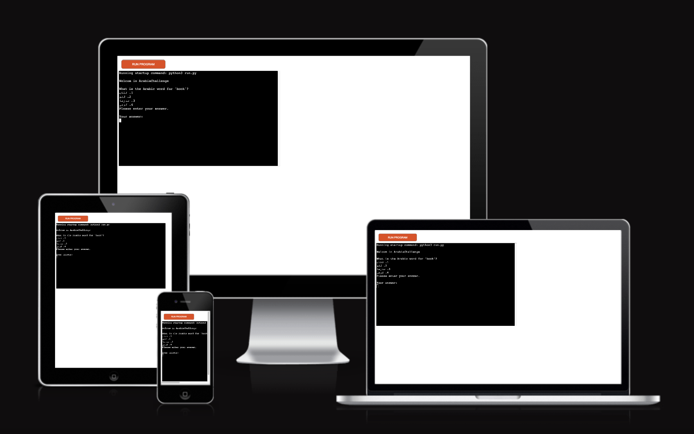
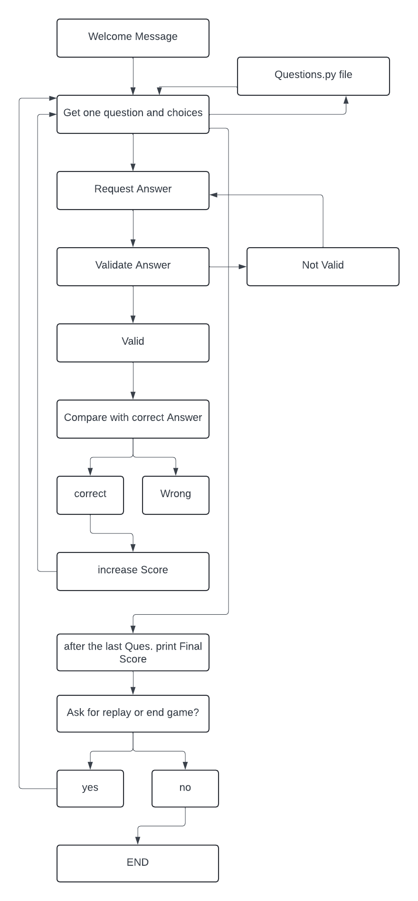

# [ARABIACHALLENGE](https://arabiachallenge-4d32641e125b.herokuapp.com)

source: [amiresponsive](https://ui.dev/amiresponsive?url=https://arabiachallenge-4d32641e125b.herokuapp.com)
## Introduction

**ArabiaChallenge** is an engaging and educational quiz game designed to help users test and enhance their knowledge of the Arabic language. The project aims to provide a fun and interactive way for individuals to learn Arabic vocabulary and phrases, making language learning more accessible and enjoyable.

## Objectives

The primary objective of ArabiaChallenge is to:

- **Promote Language Learning**: By offering a quiz format, the project encourages users to recall and apply their knowledge of Arabic in a practical manner.
- **Enhance Vocabulary**: Each question is designed to introduce and reinforce essential Arabic words and phrases.
- **Provide Instant Feedback**: Users receive immediate feedback on their answers, allowing them to learn from their mistakes and understand the correct usage of words.

## Target Audience

ArabiaChallenge is intended for:

- **Language Learners**: Individuals who are beginning to learn Arabic or want to expand their vocabulary in an interactive way.
- **Educators and Students**: Teachers can use the game as a supplementary tool in classrooms, and students can use it for self-study.
- **Travelers and Expats**: People who are planning to visit or live in Arabic-speaking countries and want to learn basic conversational Arabic.
- **Language Enthusiasts**: Anyone with an interest in learning new languages and cultures.

## Usefulness

ArabiaChallenge is useful to its target audience in several ways:

- **Interactive Learning**: The quiz format keeps users engaged and motivated to learn more.
- **Self-paced**: Users can play the game at their own pace, allowing for flexible learning schedules.
- **Immediate Feedback**: Correct and incorrect answers are immediately identified, helping users to quickly grasp the correct terms and phrases.
- **Cultural Insight**: By learning the language, users gain insights into Arabic-speaking cultures, which can enhance their travel experiences and cultural understanding.

ArabiaChallenge combines the excitement of a quiz game with the educational benefits of language learning, making it a valuable tool for anyone looking to improve their Arabic skills in an enjoyable and effective manner.

## UX

The design of ArabiaChallenge focuses on creating an intuitive, engaging, and educational experience for users. 

### Interaction Design

1. **Simplified Navigation**: The game interface is designed to be straightforward and easy to navigate. Users can quickly start a quiz, select their answers, and receive feedback without unnecessary steps or distractions.

2. **Clear Instructions**: Each question comes with clear and concise instructions, ensuring that users understand how to interact with the quiz. The input process is streamlined to avoid confusion and maintain focus on learning.

### Feedback Mechanism

1. **Immediate Feedback**: Users receive instant feedback on their answers, helping them learn and correct mistakes in real-time. This reinforces learning and keeps users motivated.

2. **Score Tracking**: The game includes a scoring system that tracks user progress and provides a sense of accomplishment. This feature encourages users to continue playing and improving their language skills.

### Accessibility

1. **Language Support**: The game supports both Arabic and English, making it accessible to users with different language backgrounds. This bilingual approach enhances usability and learning effectiveness.

By following these design processes, ArabiaChallenge aims to provide a user-friendly and effective learning experience that caters to the diverse needs of its target audience.

## Features

### Existing Features

ArabiaChallenge offers a variety of features designed to enhance the user's learning experience. Each feature provides unique value, making the game engaging and educational for users. Below are the key features of the project, with descriptions of their value and implementation.

- Welcome Message

**Feature:** Welcome Message  
**Description:** The game starts with a welcoming message to greet the user.  
**Value:** Sets a friendly and inviting tone for the game, making users feel welcomed.  
**Implementation:** Implemented in the `main` function with a simple print statement.

- Question Presentation

**Feature:** Question Presentation  
**Description:** Displays a question and multiple-choice answers to the user.  
**Value:** Provides a clear and structured format for users to read and understand the question and possible answers.  
**Implementation:** Implemented in the `get_question` function, which retrieves and prints the question and choices.

- Clear Function

**Feature:** Clear Function  
**Description:** Clears the terminal to maintain a clean user interface.  
**Value:** Enhances the visual presentation of the game and prevents clutter in the terminal.  
**Implementation:** Implemented in the `clear` function using system-specific commands.

- Arabic Text Reshaping

**Feature:** Arabic Text Reshaping  
**Description:** Corrects the display of Arabic text to be right-to-left and properly joined.  
**Value:** Ensures that Arabic text is readable and properly formatted, enhancing the user experience for Arabic speakers.  
**Implementation:** Utilizes the `arabic_reshaper` and `bidi.algorithm` libraries in the `reshape_text` function.

- Colorama Integration

**Feature:** Colorama Integration  
**Description:** Utilizes the Colorama library to add color to terminal output, enhancing visual appeal and readability.  
**Value:** Improves user experience by providing colorful and visually appealing text in the terminal interface.  
**Implementation:** Integrated Colorama library for text coloring throughout the game interface.

- User Answer Input

**Feature:** User Answer Input  
**Description:** Prompts the user to enter their answer.  
**Value:** Engages the user by allowing them to participate actively in the quiz.  
**Implementation:** Implemented in the `request_answer` function, which ensures valid input through a loop and validation function.

- Answer Validation

**Feature:** Answer Validation  
**Description:** Validates that the user's input is one of the acceptable answers (1, 2, 3, or 4).  
**Value:** Prevents invalid inputs, ensuring that the game proceeds smoothly without errors.  
**Implementation:** Implemented in the `validate_answer` function.

- Answer Comparison and Scoring

**Feature:** Answer Comparison and Scoring  
**Description:** Compares the user's answer to the correct answer, updates the score, and provides feedback.  
**Value:** Gives immediate feedback, helping users learn from their mistakes and rewarding correct answers with score increments.  
**Implementation:** Implemented in the `compare_answer` function, which adjusts the score and provides feedback.

- Final Score Display

**Feature:** Final Score Display  
**Description:** Displays the user's final score after all questions have been answered.  
**Value:** Provides a summary of the user's performance, giving a sense of achievement and areas for improvement.  
**Implementation:** Implemented in the `final_score` function, which prints the final score.

- Asking_replay

**Feature:** Replay Function  
**Description:** Allows the user to replay the game after completing it.  
**Value:** Offers users the option to continue engaging with the game and improve their performance.  
**Implementation:** Implemented in the `asking_replay` function, which prompts the user to play again or end the game.

---
By combining these features, ArabiaChallenge provides a comprehensive and enjoyable way for users to test and improve their Arabic language skills. Each feature has been carefully designed to contribute to an engaging and educational experience.

### Future Features

To further enhance the ArabiaChallenge experience, several future features are planned. These features aim to improve user engagement, provide additional learning resources, and create a more interactive and personalized experience.

 1. Leaderboard

**Feature:** Leaderboard  
**Description:** Implement a leaderboard to display the top scores of users.  
**Value:** Encourages healthy competition among users, motivating them to improve their scores and engage more frequently with the quiz.  
**Implementation Plan:** Store user scores in a database and display the top scores on a leaderboard page. This feature will require user authentication to track individual progress.

 2. Multiple Difficulty Levels

**Feature:** Multiple Difficulty Levels  
**Description:** Introduce different difficulty levels (e.g., beginner, intermediate, advanced) for the quiz questions.  
**Value:** Provides a tailored learning experience for users of varying proficiency levels, making the game more accessible and challenging for all users.  
**Implementation Plan:** Categorize questions by difficulty level and allow users to select their preferred level before starting the quiz.

 3. Timed Challenges

**Feature:** Timed Challenges  
**Description:** Add a timed challenge mode where users must answer questions within a certain time limit.  
**Value:** Adds an element of urgency and excitement, enhancing the quiz's challenge and testing users' quick thinking and recall abilities.  
**Implementation Plan:** Implement a countdown timer for each question and adjust the scoring system to reward quick and correct answers.

 4. Detailed Explanations

**Feature:** Detailed Explanations  
**Description:** Provide detailed explanations for each answer after the user responds.  
**Value:** Enhances learning by explaining why an answer is correct or incorrect, helping users understand the material better and retain information.  
**Implementation Plan:** Include explanations in the question data and display them after the user submits an answer.

These future features aim to make ArabiaChallenge more engaging, educational, and enjoyable, ultimately helping users improve their Arabic language skills more effectively.

## Tools & Technologies Used

-  used to generate README and TESTING templates.
-  used for version control. (`git add`, `git commit`, `git push`)
-  used for secure online code storage.
-  used as a cloud-based IDE for development.
-  used as the back-end programming language.
-  used for hosting the deployed back-end site.
-  used to help debug, troubleshoot, and explain things.

## Data Model

### Flowchart

To follow best practice, a flowchart was created for the app's logic,
and mapped out before coding began using a free version of
[Lucidchart](https://www.lucidchart.com/pages/ER-diagram-symbols-and-meaning) .

Below is the flowchart of the main process of this Python program. It shows the entire cycle of the program.

### Classes & Functions

The ArabiaChallenge project uses various functions to modularize the code, ensuring reusability, maintainability, and clarity. Here are the primary functions used in this application:

- `reshape_text(text)`
  - Corrects the display of Arabic text to ensure it appears right-to-left and properly shaped.
- `get_question(ques_num)`
    - Retrieves and displays a question and its choices from the list of questions.
- `request_answer()`
    - Request answer from input and calls the validate_data function.
- `validate_data()`
    - Converts all string values into integers.
- `compare_answer(player_answer, correct_answer, score)`
  - Compares the user's answer with the correct answer, updates the score, and provides feedback on the user's answer.
- `final_score(total_ques, score)`
  - Displays the user's final score after all questions have been answered.
- `clear()`
  - Clear function to clean-up the terminal so things don't get messy.
- `asking_replay()`
  - Asking the player for replay or to end the game.
- `main()`
  - Runs the main loop of the quiz, calling other functions to display questions, collect answers, and track the score.

### Imports

I've used the following Python packages and/or external imported packages.

- `os`: Used for system-specific operations and clearing the terminal.
- `random`: Utilized for shuffling the questions list to present them in a random order.
- `colorama`: Enables cross-platform support for styling text in the terminal, enhancing the visual presentation of the game.
- `questions`: Imports the questions data structure from the questions module, which contains the list of questions, choices, and correct answers.
- `arabic_reshaper`: Utilized for reshaping Arabic text to ensure proper display from right to left.
- `bidi.algorithm`: Enables bidirectional text rendering for Arabic text to ensure correct visualization.
## Testing

> [!NOTE]  
> For all testing, please refer to the [TESTING.md](TESTING.md) file.

## Deployment

Code Institute has provided a [template](https://github.com/Code-Institute-Org/python-essentials-template) to display the terminal view of this backend application in a modern web browser.
This is to improve the accessibility of the project to others.

The live deployed application can be found deployed on [Heroku](https://arabiachallenge-4d32641e125b.herokuapp.com).

### Heroku Deployment

This project uses [Heroku](https://www.heroku.com), a platform as a service (PaaS) that enables developers to build, run, and operate applications entirely in the cloud.

Deployment steps are as follows, after account setup:

- Select **New** in the top-right corner of your Heroku Dashboard, and select **Create new app** from the dropdown menu.
- Your app name must be unique, and then choose a region closest to you (EU or USA), and finally, select **Create App**.
- From the new app **Settings**, click **Reveal Config Vars**, and set the value of KEY to `PORT`, and the value to `8000` then select *add*.
- Further down, to support dependencies, select **Add Buildpack**.
- The order of the buildpacks is important, select `Python` first, then `Node.js` second. (if they are not in this order, you can drag them to rearrange them)

Heroku needs three additional files in order to deploy properly.

- requirements.txt
- Procfile
- runtime.txt

You can install this project's **requirements** (where applicable) using:

- `pip3 install -r requirements.txt`

If you have your own packages that have been installed, then the requirements file needs updated using:

- `pip3 freeze --local > requirements.txt`

The **Procfile** can be created with the following command:

- `echo web: node index.js > Procfile`

The **runtime.txt** file needs to know which Python version you're using:
1. type: `python3 --version` in the terminal.
2. in the **runtime.txt** file, add your Python version:
	- `python-3.9.19`

For Heroku deployment, follow these steps to connect your own GitHub repository to the newly created app:

Either:

- Select **Automatic Deployment** from the Heroku app.

Or:

- In the Terminal/CLI, connect to Heroku using this command: `heroku login -i`
- Set the remote for Heroku: `heroku git:remote -a app_name` (replace *app_name* with your app name)
- After performing the standard Git `add`, `commit`, and `push` to GitHub, you can now type:
	- `git push heroku main`

The frontend terminal should now be connected and deployed to Heroku!

### Local Deployment

This project can be cloned or forked in order to make a local copy on your own system.

For either method, you will need to install any applicable packages found within the *requirements.txt* file.

- `pip3 install -r requirements.txt`.

#### Cloning

You can clone the repository by following these steps:

1. Go to the [GitHub repository](https://github.com/ibra8080/ArabiaChallenge) 
2. Locate the Code button above the list of files and click it 
3. Select if you prefer to clone using HTTPS, SSH, or GitHub CLI and click the copy button to copy the URL to your clipboard
4. Open Git Bash or Terminal
5. Change the current working directory to the one where you want the cloned directory
6. In your IDE Terminal, type the following command to clone my repository:
	- `git clone https://github.com/ibra8080/ArabiaChallenge.git`
7. Press Enter to create your local clone.

Alternatively, if using Gitpod, you can click below to create your own workspace using this repository.

Please note that in order to directly open the project in Gitpod, you need to have the browser extension installed.
A tutorial on how to do that can be found [here](https://www.gitpod.io/docs/configure/user-settings/browser-extension).

#### Forking

By forking the GitHub Repository, we make a copy of the original repository on our GitHub account to view and/or make changes without affecting the original owner's repository.
You can fork this repository by using the following steps:

1. Log in to GitHub and locate the [GitHub Repository](https://github.com/ibra8080/ArabiaChallenge)
2. At the top of the Repository (not top of page) just above the "Settings" Button on the menu, locate the "Fork" Button.
3. Once clicked, you should now have a copy of the original repository in your own GitHub account!

### Local VS Deployment

There are no differences between the local version developed and the live deployment site on Heroku.

## Credits

### Libraries and Tools
- [arabic_reshaper](https://github.com/mpcabd/python-arabic-reshaper) - Used for reshaping Arabic text.
- [python-bidi](https://github.com/MeirKriheli/python-bidi): Utilized for displaying bidirectional text, enhancing readability for Arabic speakers.
- [colorama](https://pypi.org/project/colorama/): Employed for cross-platform colored terminal text, enhancing the visual appeal of the application.
- [random](https://docs.python.org/3/library/random.html): Utilized for shuffling the questions list, providing variety in question order for the user.

### Contributors
- [Ibrahim Abusaif](https://github.com/ibra8080) - Initial development.

### Acknowledgements
- I would like to thank my Code Institute mentor, [Tim Nelson](https://github.com/ibra8080/pyramidexplorer/blob/main/README.md) for his support throughout the development of this project.
- I would like to thank the [Code Institute](https://codeinstitute.net/de/) tutor team for their assistance.
- I would like to thank the [Code Institute Slack community](https://app.slack.com/client/T0L30B202/C06SRSQFFK3) for the moral support; it kept me going during periods of self doubt.
- Assistance provided by [OpenAI's ChatGPT](https://www.openai.com/chatgpt) for code debugging and documentation.

### Content

| Source | Location | Notes |
| --- | --- | --- |
| [Markdown Builder](https://tim.2bn.dev/markdown-builder) | README and TESTING | tool to help generate the Markdown files |
| [Real python](https://realpython.com/python-quiz-application/) | entire site | Build a Quiz Application With Python |
| [TechWithTim](https://www.youtube.com/watch?v=u51Zjlnui4Y) | entire site | using `colorama()`  to print Colored Text in Python |

