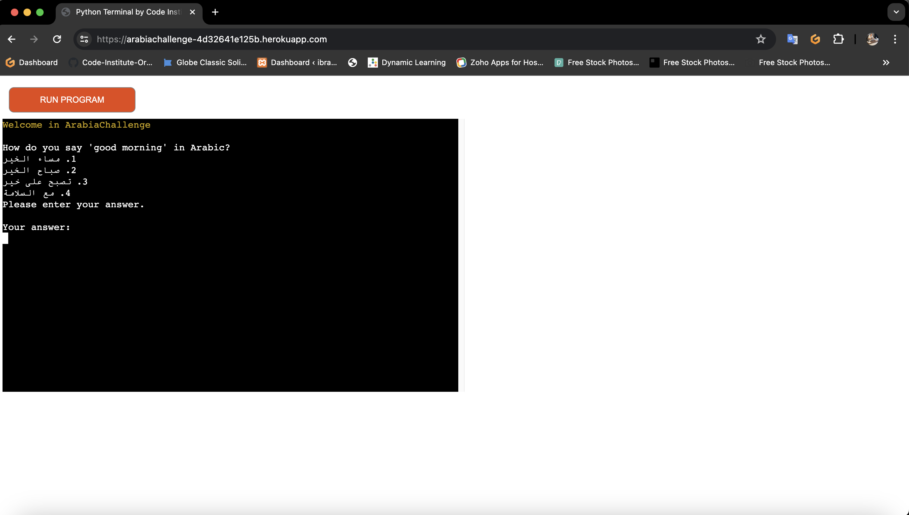
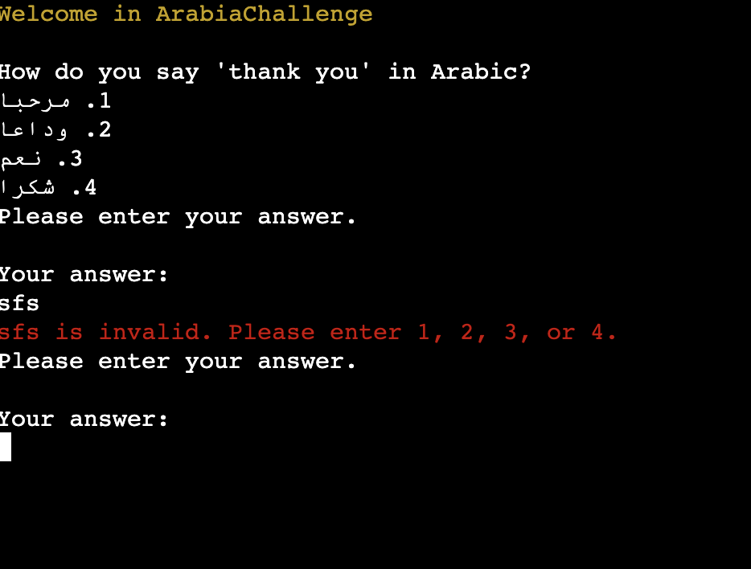

# Testing

> [!NOTE]  
> Return back to the [README.md](README.md) file.

## Code Validation

### Python

I have used the recommended [PEP8 CI Python Linter](https://pep8ci.herokuapp.com) to validate all of my Python files.

| Directory | File | CI URL | Screenshot | Notes |
| --- | --- | --- | --- | --- |
|  | questions.py | [PEP8 CI](https://pep8ci.herokuapp.com/https://raw.githubusercontent.com/ibra8080/ArabiaChallenge/main/questions.py) |  | |
|  | run.py | [PEP8 CI](https://pep8ci.herokuapp.com/https://raw.githubusercontent.com/ibra8080/ArabiaChallenge/main/run.py) |  | |

## Browser Compatibility

I've tested my deployed project on multiple browsers to check for compatibility issues.

| Browser | Screenshot | Notes |
| --- | --- | --- |
| Chrome |  | Works as expected |
| Firefox |  |  Works as expected |
| Safari |  | Works as expected |
| Opera |  | Minor differences |

## Responsiveness
I've tested my deployed project on multiple devices to check for responsiveness issues.

| Device | Screenshot |Notes |
| --- | --- | --- |
| Mobile (DevTools) |  | Works as expected |
| Tablet (DevTools) |  |  Works as expected |
| Desktop |  | Works as expected |

## Lighthouse Audit
I've tested my deployed project using the Lighthouse Audit tool to check for any major issues.

| Page | Notes |
| --- | --- |
|  | Some minor warnings |

## Defensive Programming

Defensive programming was manually tested with the below user acceptance testing:

| Function | Expectation | Test| Result | Fix | Screenshot |
|----|----|----|----|----|----|
| `request_answer` | Users must enter a valid answer (1, 2, 3, or 4) | Entered a valid answer (e.g., '2')   | Answer accepted and validated as expected | Test concluded and passed |   |
|  | Users cannot submit an empty answer                                                             | Pressed Enter without typing         | Error message displayed and prompted for input again | Test concluded and passed |    |
| `validate_answer`| Answers must be validated to ensure they are within the specific list (1, 2, 3, or 4)| Entered a valid answer (e.g., '2')   | Validation successful| Test concluded and passed |   | 
|   | | Entered an invalid answer (e.g., 'sfs')| Error message displayed | Test concluded and passed | |
| `asking_replay`  | Users must choose from a specific list only ('yes' or 'no')                                      | Entered 'yes' | Game restarted as expected | Test concluded and passed |  |
|  |  | Entered 'no' | Game ended as expected | Test concluded and passed |  |
| | Users cannot submit an invalid answer for replay prompt                                         | Entered an invalid answer (e.g., 'maybe') | Error message displayed and prompted for input again  | Test concluded and passed |  |

## Bugs
- Python repeatedly displays "Invalid input. Please enter 1, 2, 3, or 4." when user inputs are invalid.

    

    - To fix this, I ensured that the user input is correctly captured and validated. I provided clear guidance to the user on expected inputs and added validation to check if the input is among the valid options ('1', '2', '3', or '4').

- Python raises `TypeError` when trying to access questions in `run.py`.

    

    - To fix this, I corrected the key used to access the questions in the dictionary, ensuring it matches the correct data structure.
- Arabic text not displayed correctly:

  

  - To fix this, I used the `arabic_reshaper` and `bidi.algorithm` libraries to properly format and display Arabic text.

- Python raises `NoneType` object is not subscriptable error in `compare_answer` function:

  

  - To fix this, I ensured that `get_question` returns a valid dictionary and that the `question_data` variable is correctly assigned before being used in the `compare_answer` function.

## Unfixed Bugs

- Arabic Text Alignment Issue**: 
  - Sometimes, during the reshaping of Arabic text, there might be alignment issues, especially when the text contains a mix of Arabic and non-Arabic characters. This could lead to misalignment in the output, impacting readability.
  
    

    - Attempted fix: Implement more robust text alignment algorithms or consider alternative approaches to handle mixed Arabic and non-Arabic text alignment.

- Commit Message Convention: 
  - Some commit messages begin with lowercase letters instead of starting with an uppercase letter and using imperative mood, which can affect readability and consistency. I will ensure to address this in future commits.

> [!NOTE]  
> There are no remaining bugs that I am aware of.
